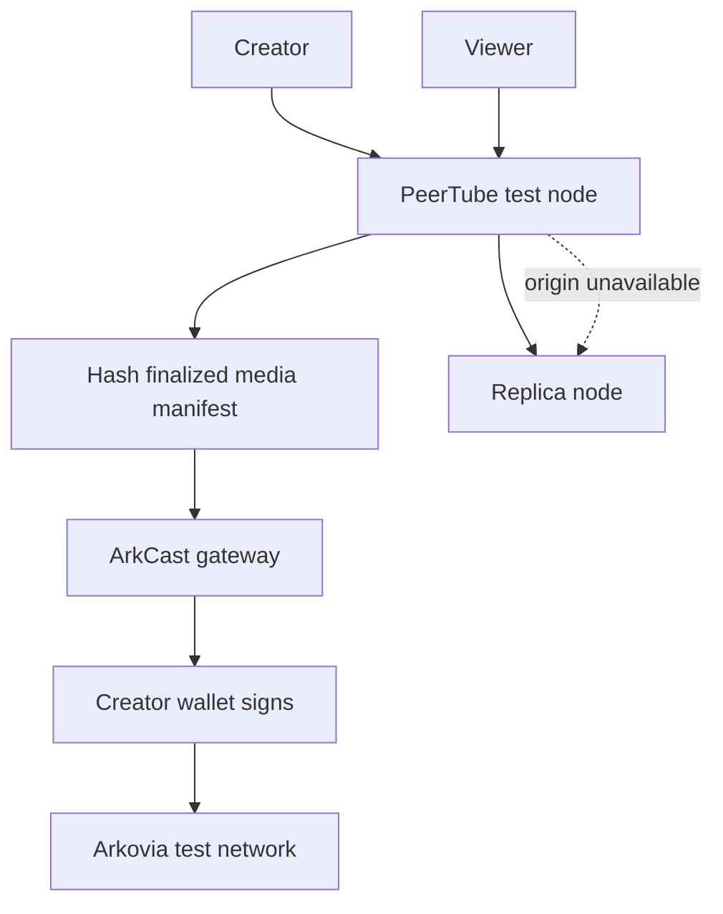

# ADR-001: Hybrid foundation

## Status

Accepted for Phase 0 validation.

## Decision

ArkCast will begin as a custom application around three deliberately separated boundaries:

1. **PeerTube video infrastructure** for uploads, transcoding, adaptive playback, federation, and initial redundancy.
2. **ArkCast application services** for the consumer experience, family controls, safety policy, creator economy, privacy-conscious analytics, search coordination, and replication policy.
3. **Arkovia blockchain gateway** for trusted node selection, creator-key verification, compact publication proofs, ARKOS payment monitoring, and confirmation handling.

LBRY is a reference implementation and possible source of individually reviewed MIT-licensed components. ArkCast will not depend on the LBRY blockchain or LBC.

## Governing boundaries

- Video bytes, HLS segments, captions, thumbnails, viewing history, child data, and moderation evidence remain off-chain.
- Browsers never send wallet private keys, seed phrases, or account passwords to ArkCast.
- Blockchain writes are explicit user-authorized actions; routine views and engagement events are not transactions.
- Community nodes are untrusted. Content is accepted only after hash and manifest verification.
- A deletion-capable replication control plane is required; decentralization does not make prohibited material immortal.
- PeerTube modifications and network deployment must comply with AGPL-3.0 obligations.
- Arkovia consensus changes are out of scope until the existing repository and protocol are fully audited.
- The current Arkovia baseline fee is 1 ARKOS. The desired 0.01 ARKOS minimum requires separately reviewed consensus work and must not be assumed by ArkCast.

## Why not a direct fork first?

A deep PeerTube fork would inherit a large maintenance and upgrade burden before ArkCast has validated its unique requirements. Phase 0 therefore favors documented APIs, plugins, themes, and separate services. A fork is reconsidered only if a required capability cannot be implemented safely through supported extension points.

## Phase 0 target flow

